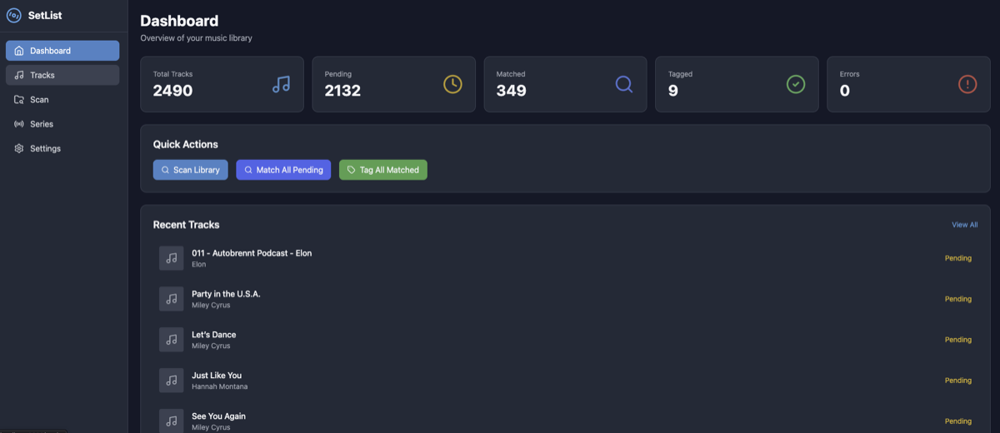
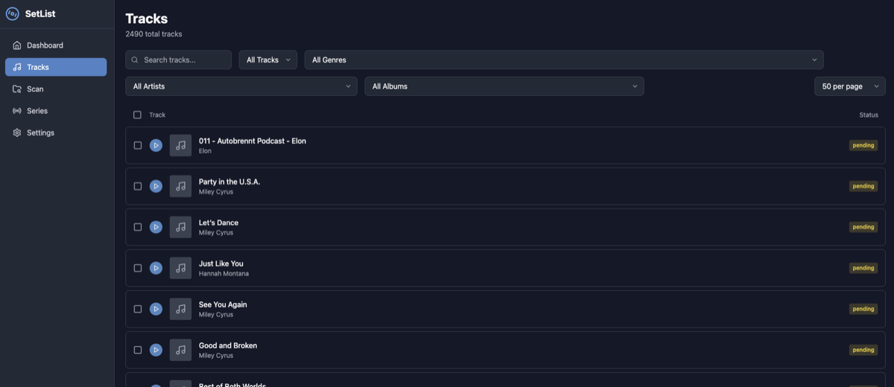
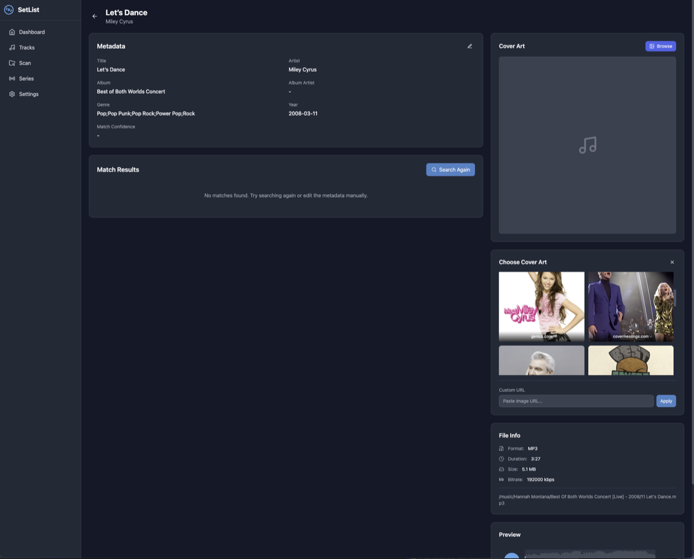
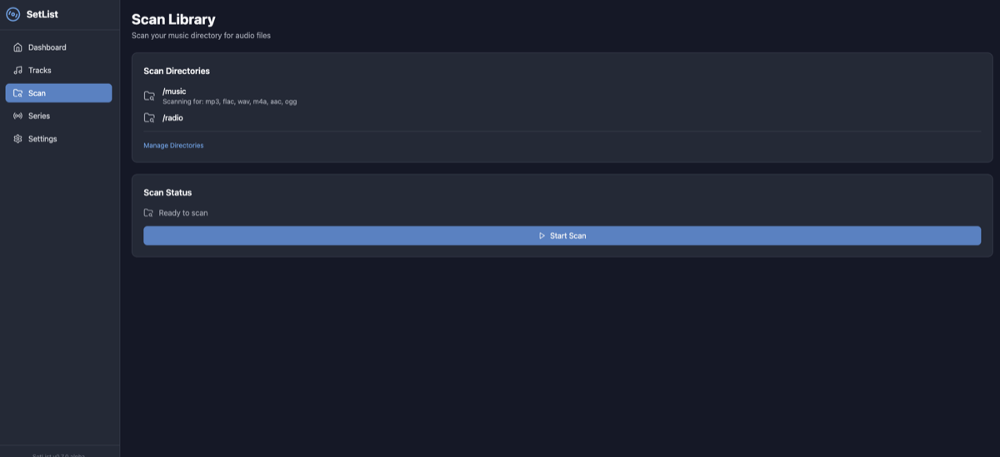
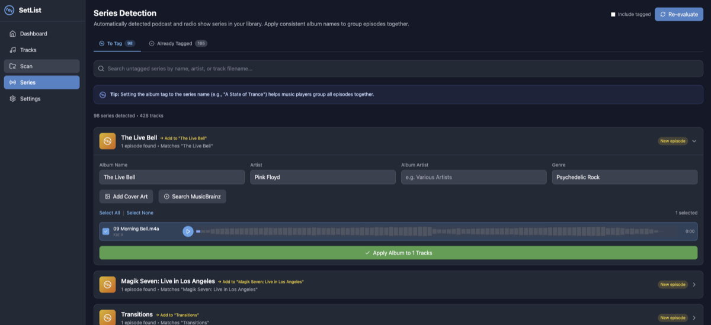
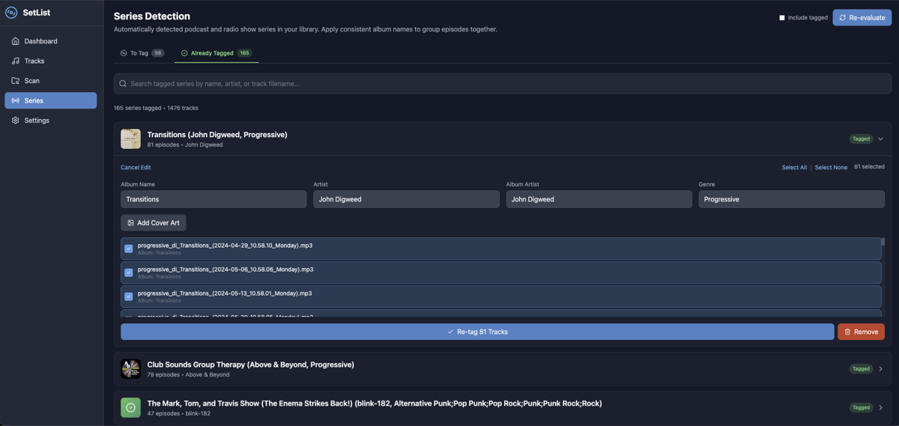
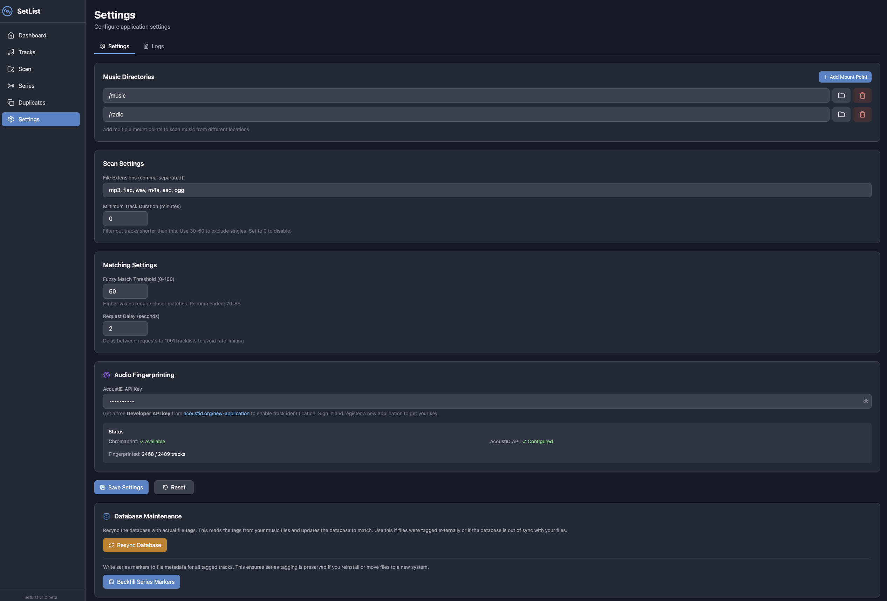

# SetList

A Docker application for organizing and tagging your music library - DJ sets, podcasts, radio shows, and CD albums. Uses metadata from 1001Tracklists.com and MusicBrainz to automatically identify and tag your tracks.

## Screenshots

### Dashboard
Overview of your library with quick stats and recent tracks.



### Tracks
Browse and filter your entire music library.



### Track Detail
View and edit metadata, search for matches, and choose cover art.



### Scan
Configure directories and scan for new audio files.



### Series Detection
Automatically group radio shows and podcast episodes together.





### Settings
Configure scan settings, matching thresholds, and manage your database.



## Features

- 🎵 **Automatic Scanning**: Scans directories for audio files (MP3, FLAC, WAV, M4A, AAC, OGG)
- 🔍 **Fuzzy Matching**: Uses intelligent fuzzy string matching to find potential track matches on 1001Tracklists
- 💿 **MusicBrainz Integration**: Search and identify CD albums using the MusicBrainz database
- 📝 **Metadata Tagging**: Automatically tags tracks with artist, title, genre, and more
- 🖼️ **Cover Art Download**: Downloads and embeds cover art from matched tracklists
- 🎧 **Audio Player with Waveform**: Preview tracks with real-time waveform visualization
- 👁️ **Web Interface**: Modern dark-themed UI to review matches and make corrections
- 📦 **Batch Operations**: Process multiple tracks at once or one at a time
- ✏️ **Manual Editing**: Edit metadata manually when automatic matching isn't accurate
- 📁 **Smart Renaming**: Batch rename files using customizable patterns
- 📻 **Series Detection**: Automatically groups radio shows and podcast episodes
- 🤖 **AI-Ready**: Architecture prepared for future AI-based matching (audio fingerprinting, etc.)

## Installation on Unraid

### Method 1: Using Docker Compose (Recommended)

1. SSH into your Unraid server or use the terminal

2. Create the app directory:
   ```bash
   mkdir -p /mnt/user/appdata/setlist
   cd /mnt/user/appdata/setlist
   ```

3. Download the project (or git clone):
   ```bash
   git clone https://github.com/yourusername/setlist.git .
   ```

4. Edit `docker-compose.yml` to set your music path:
   ```yaml
   volumes:
     - ./config:/config
     - /mnt/user/media/music/dj-sets:/music  # Change this to your path
   ```

5. Build and start:
   ```bash
   docker-compose up -d --build
   ```

6. Access the web UI at `http://your-unraid-ip:8080`

### Method 2: Using Unraid Docker Template

1. In Unraid, go to **Docker** tab
2. Click **Add Container**
3. Use these settings:
   - **Name**: `setlist`
   - **Repository**: Build locally or use `ghcr.io/yourusername/setlist:latest`
   - **Network Type**: `Bridge`
   
4. Add port mappings:
   - `8080` -> `8080` (Web UI)
   - `5000` -> `5000` (API)

5. Add path mappings:
   - `/music` -> Your DJ sets folder (e.g., `/mnt/user/media/music/dj-sets`)
   - `/config` -> `/mnt/user/appdata/setlist`

6. Click **Apply**

### Method 3: Manual Docker Run

```bash
# Build the image
cd /mnt/user/appdata/setlist
docker build -t setlist .

# Run the container
docker run -d \
  --name setlist \
  --restart unless-stopped \
  -p 8080:8080 \
  -p 5000:5000 \
  -v /mnt/user/media/music/dj-sets:/music \
  -v /mnt/user/appdata/setlist/config:/config \
  -e TZ=America/New_York \
  setlist
```

## Usage Guide

### 1. Initial Setup
1. Open the web UI at `http://your-server:8080`
2. Go to **Settings** and verify your music directory path
3. Adjust the fuzzy matching threshold if needed (default: 70%)

### 2. Scan Your Library
1. Go to **Scan** page
2. Click **Start Scan**
3. Wait for the scan to complete (progress shown in real-time)

### 3. Review Matches
1. Go to **Tracks** page
2. Click on a track to see match candidates
3. Review the suggested matches from 1001Tracklists
4. Click on the best match to select it

### 4. Apply Tags
1. Once a match is selected, click **Apply Tags to File**
2. The track's metadata (title, artist, genre) and cover art will be written to the file
3. Use batch operations to process multiple tracks at once

### 5. Batch Operations
- **Match All Pending**: Automatically search for matches for all unmatched tracks
- **Tag All Matched**: Apply tags to all tracks that have been matched
- **Batch Rename**: Rename files using a pattern like `{artist} - {title}`

## Configuration

### Environment Variables

| Variable | Default | Description |
|----------|---------|-------------|
| `MUSIC_DIR` | `/music` | Directory to scan for audio files |
| `CONFIG_DIR` | `/config` | Directory for database and settings |
| `SCAN_EXTENSIONS` | `mp3,flac,wav,m4a,aac,ogg` | File extensions to scan |
| `TZ` | `UTC` | Timezone |

### Settings (via Web UI)

- **Music Directory**: Path to your audio files
- **File Extensions**: Which file types to scan
- **Fuzzy Threshold**: Minimum match confidence (0-100)
- **Request Delay**: Delay between 1001Tracklists requests (to avoid rate limiting)

## Architecture

```
setlist/
├── backend/                 # FastAPI Python backend
│   ├── api/                 # REST API routes
│   │   ├── tracks.py        # Track CRUD operations
│   │   ├── scan.py          # Directory scanning
│   │   ├── match.py         # 1001Tracklists matching
│   │   ├── tags.py          # Metadata tagging
│   │   └── settings.py      # App configuration
│   ├── services/            # Business logic
│   │   ├── scanner.py       # File scanning service
│   │   ├── matcher.py       # Fuzzy matching engine
│   │   ├── tagger.py        # Audio file tagging
│   │   ├── musicbrainz.py   # MusicBrainz API integration
│   │   ├── tracklists_api.py # 1001Tracklists scraper
│   │   └── database.py      # SQLite database
│   ├── models/              # SQLAlchemy & Pydantic models
│   │   └── track.py         # Track data models
│   └── main.py              # FastAPI application
├── frontend/                # React + Vite frontend
│   ├── src/
│   │   ├── components/      # Reusable components
│   │   ├── pages/           # Page components
│   │   └── api.js           # API client
│   └── package.json
├── docker/                  # Docker configuration
│   └── start.sh             # Container startup script
├── unraid/                  # Unraid-specific files
│   └── setlist.xml          # Unraid template
├── Dockerfile               # Production Docker build
├── docker-compose.yml       # Docker Compose config
└── README.md
```

## API Endpoints

| Method | Endpoint | Description |
|--------|----------|-------------|
| GET | `/api/health` | Health check |
| GET | `/api/tracks` | List all tracks |
| GET | `/api/tracks/{id}` | Get track details |
| PATCH | `/api/tracks/{id}` | Update track metadata |
| POST | `/api/scan/start` | Start directory scan |
| GET | `/api/scan/status` | Get scan progress |
| POST | `/api/match/{id}` | Find matches for track |
| POST | `/api/match/batch` | Batch match tracks |
| POST | `/api/tags/{id}/apply` | Apply tags to file |
| GET | `/api/settings` | Get settings |
| PATCH | `/api/settings` | Update settings |

## Troubleshooting

### No matches found
- Check that the filename contains the DJ/artist name
- Try manually searching on 1001Tracklists to verify the set exists
- Lower the fuzzy threshold in Settings

### Rate limiting (403 errors)
- Increase the request delay in Settings
- Wait a few minutes before retrying

### Tags not saving
- Ensure the container has write permissions to the music directory
- Check that the file format is supported (MP3, FLAC, M4A, OGG)

### Scan not finding files
- Verify the path mapping in Docker
- Check that the file extensions are in the scan list

## Changelog

### v0.7.0-alpha
- ✨ **Audio Player with Waveform**: Play tracks directly in the browser with real-time waveform visualization
- 🎵 **MusicBrainz Integration**: Search and identify CD albums using MusicBrainz/CDDB database
- 📀 **Album-Based Grouping**: Automatically groups tracks by existing album metadata (great for CD rips)
- 🔄 **Single Track Playback**: Only one track plays at a time across the entire app
- 🎨 **Visual Indicators**: Album groups show distinct green styling, orphan tracks show yellow
- ➕ **Alternative Series Matches**: View and select from multiple potential series matches with confidence scores
- ❌ **Remove from Series**: Easily remove tracks that were incorrectly added to a series
- 🔧 **Toast Notifications Fix**: Close button on notifications now works correctly

### v0.6.5-alpha
- Series marker persistence improvements
- Orphan track detection and re-evaluation
- Cover art search enhancements

## Future Enhancements

- [ ] Audio fingerprinting (AcoustID/Shazam-style matching)
- [ ] AI-powered metadata extraction
- [ ] Spotify/Beatport integration
- [ ] Cue file generation
- [x] ~~Waveform visualization~~ ✅ Added in v0.7.0
- [ ] Mobile-responsive UI improvements

## Credits

- [1001-tracklists-api](https://github.com/jvenuto80/1001-tracklists-api) - Inspiration and reference for 1001Tracklists scraping
- [Mutagen](https://mutagen.readthedocs.io/) - Python audio metadata handling
- [RapidFuzz](https://github.com/maxbachmann/RapidFuzz) - Fast fuzzy string matching
- [FastAPI](https://fastapi.tiangolo.com/) - Modern Python web framework
- [React](https://react.dev/) - Frontend framework
- [Tailwind CSS](https://tailwindcss.com/) - Styling

## License

MIT License - see LICENSE file for details.

## Contributing

Contributions welcome! Please open an issue or PR on GitHub.
